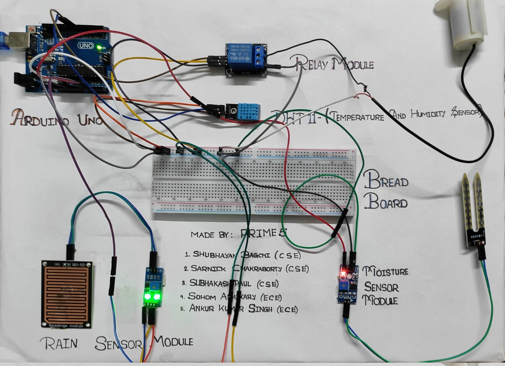

# Smart-Irrigation-System-using-Arduino

  

<h2>Description :-</h2>
<ul>
  <li>The “Smart Irrigation System Using Arduino Uno” project presents a comprehensive solution for efficient irrigation in agriculture by incorporating Arduino Uno microcontroller, a soil moisture sensor, a rain sensor, and a motor.</li>
  <li>The system continuously monitors the soil moisture level using the soil moisture sensor. When the moisture falls below a specific threshold, indicating the need for irrigation, the Arduino Uno triggers the motor to supply water to the plants.</li>
  <li>To avoid overwatering and conserve water resources, a rain sensor is integrated into the system. The rain sensor detects rainfall and temporarily suspends the irrigation process, ensuring that plants receive water only when necessary.</li>
  <li>By combining the Arduino Uno, soil moisture sensor, rain sensor, and motor, the project creates a smart irrigation system that optimizes water usage and promotes sustainable agricultural practices. The system eliminates manual intervention and reduces the risk of underwatering or overwatering plants.</li>
  <li>The Arduino Uno serves as the central control unit, receiving data from the soil moisture sensor and rain sensor. It processes this data and activates the motor based on the sensor readings, ensuring efficient water distribution.</li>
  <li>The smart irrigation system presented in this project offers numerous advantages, including improved plant health, reduced water consumption, and increased crop yield. It provides a cost-effective and automated solution for farmers and gardeners, enhancing irrigation management and conserving valuable resources.</li>
  <li>In conclusion, the “Smart Irrigation System Using Arduino Uno” project leverages the Arduino Uno microcontroller, soil moisture sensor, rain sensor, and motor to create an intelligent irrigation system. By considering soil moisture levels and rainfall, the system optimizes irrigation practices, resulting in healthier plants and efficient water utilization.</li>
</ul>
<h2>Components Used :-</h2>
<ul>
  <li>Arduino Uno</li>
  <li>Arduino Cable</li>
  <li>Rain Sensor</li>
  <li>Moisture sensor</li>
  <li>DHT11 Sensor</li>
  <li>Connecting Wires</li>
  <li>Mini water pump</li>
</ul>
<h2>Libraries Used :-</h2>
<ul>
  <li>LiquidCrystal.h</li>
  <li>DHT.11</li>
</ul>
<h2>Made by</h2>
<a href="https://github.com/S11UB11AYAN">Shubhayan Bagchi</a>  
<a href="https://github.com/sarnick005">Sarnick Chakraborty</a>
